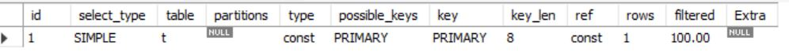

# Explain
SQL 명령어 중 `explain`(=`describe`)에 대해 살펴보고자 한다.

## Definition
Explain은 쿼리의 실행 계획을 알고자 할 때 사용하는 명령어이다.([출처](https://cheese10yun.github.io/mysql-explian/))

`select` 명령어 앞에 `explain`을 두면 MySQL은 쿼리 실행 플랜 정보를 옵티마이저에서 가져와서 출력한다.([출처](http://chongmoa.com/sql/8840))

## Description
```sql
explain select * from [table_name] as t where id = 1;
```
해당 구문을 실행했을 때의 결과는 아래와 같다.


각 항목에 대한 의미는 다음과 같다.
* select_type
  * select 구문의 실행 타입
  * 서브쿼리나 UNION이 없는 경우 SIMPLE로 표시
  * [다른 유형](https://shlee0882.tistory.com/155)
* table  
  * 어떤 테이블에 대해 설명하고 있는지
  * 별칭을 설정한 경우엔 별칭을 표시 
* partitions
  * 파티셔닝이 되어있는 경우 표시
  * 파티셔닝 안되어있으면 null
* type
  * join 타입
  * 위 이미지의 const는 테이블의 조건을 만족하는 레코드가 1개일때 표시됨
  * ALL로 표시되면 full-scan
  * [다른 유형](http://chongmoa.com/sql/8840)
* possible_keys
  * 옵티마이저가 쿼리 처리를 위해 고려한 인덱스 후보
  * 조건에 PK가 있으면 PRIMARY KEY
  * PK가 아닌 인덱스를 조건으로 사용하면 인덱스명이 표시됨
  * null로 표시되면 조건 컬럼과 연관된 인덱스를 찾지 못하였다는 의미 
* key
  * possible_keys에 있는 키 중에서 옵티마이저가 실제로 선택한 key
* key_len
  * 선택된 인덱스의 길이
  * 옵티마이저가 선택한 인덱스의 길이 값([출처](https://shlee0882.tistory.com/155))
  * 인덱스 컬럼이 가질 수 있는 최대 길이([출처](https://snowple.tistory.com/377))
* ref
  * 행을 추출하는데 키와 함께 사용된 컬럼이나 상수값 
* rows
  * 쿼리를 수행하기 위해 검색해야 할 row의 개수
  * row 개수를 줄일수록 퍼포먼스 향상
* filtered
  * MySQL 엔진에 의해 필터링되고 남은 레코드의 비율([출처](https://weicomes.tistory.com/154))
  * 실제 값이 아닌 통계적으로 예측한 비율
* Extra
  * MySQL이 쿼리를 어떻게 해석하는지에 대한 힌트
  * [유형](https://cheese10yun.github.io/mysql-explian/#null)

### 여담
속도 빠르게 하는 방법 찾다가 알게된 것이 explain이다.  
explain을 통해 파악한 정보로 더 나은 쿼리를 작성할 수 있게 도움을 준다고 한다.

## Reference
  https://cheese10yun.github.io/mysql-explian/  
  http://chongmoa.com/sql/8840  
  https://shlee0882.tistory.com/155  
  https://snowple.tistory.com/377  
  https://weicomes.tistory.com/154
